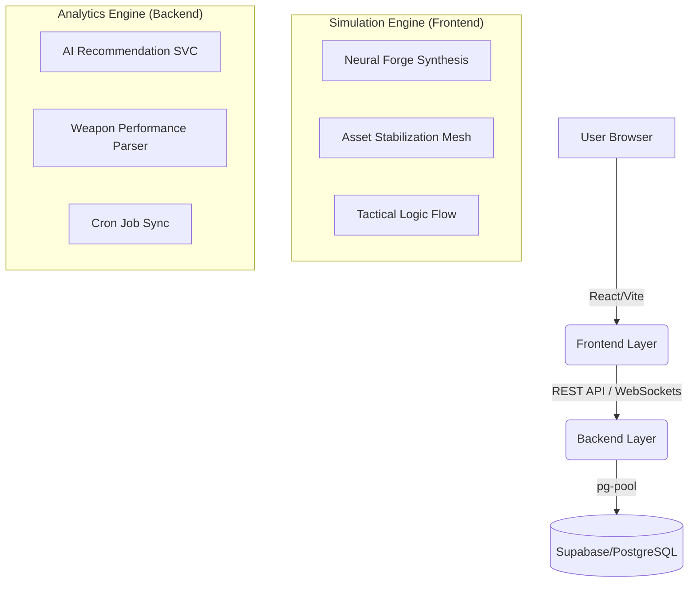

# Battlefield 6 Stats: Tactical Deployment & Engine Overview

This document provides the complete structure, dependencies, and deployment steps for the Battlefield 6 Stats platform "Engine".

## 1. Project Architecture & Structure

### File Structure
- `src/`: Frontend React source.
  - `pages/NeuralForge.tsx`: Main simulation interface.
  - `services/aiService.ts`: Simulated AI backbone.
- `backend/`: Node/Express source.
  - `src/services/aiAnalytics.ts`: Backend analytics engine.
  - `src/setup_db.ts`: Database schema initialization.
- `.github/workflows/`: (Optional) CI/CD automation.
- `docker-compose.yml`: For local containerized development.

---

## 2. Deployment Steps (Free Resources)

### Phase 1: Database (Supabase / Neon)
1. Create a PostgreSQL instance on [Supabase](https://supabase.com).
2. Run the schema in `backend/src/setup_db.ts`.

### Phase 2: Backend (Render / Railway)
1. Create a Web Service from the `backend/` directory.
2. Set Environment Variables:
   - `DB_HOST`, `DB_PORT`, `DB_NAME`, `DB_USER`, `DB_PASSWORD` (from Supabase).
   - `JWT_SECRET` (Secure random string).
   - `FRONTEND_URL` (Wait for Phase 3).

### Phase 3: Frontend (Vercel)
1. Connect GitHub repository to [Vercel](https://vercel.com).
2. Set `VITE_API_URL` to your Backend URL.

---

---

## 4. Live Retrieval Engine & Flow

The Battlefield 6 Stats "Engine" operates on a real-time data retrieval architecture:

### Interactive Flow
1. **Simulation Sequence**: When a user enters the `Simulation` page, the frontend establishes a connection with the backend (via `VITE_BACKEND_URL`).
2. **State Persistence**: The "Neural Forge" saves mission progress to the `game_saves` table using the `/api/game/save` endpoint.
3. **Analytics Retrieval**: The `Armory` and `Leaderboard` pages fetch live player metrics using `analyticsApi` and `leaderboardApi`, ensuring that "Mastery Level" and "Global Ranking" reflect real-time database state.
4. **AI Generation**: The `NeuralForge` utilizes `aiService` to simulate synthetic asset generation, which can be extended with real LLM endpoints by updating the service layer.

### Deployment Hardening
- **Database**: Ensure the `UNIQUE` constraint on `user_id` in `game_saves` is applied to prevent duplicate record glitches.
- **CORS**: The backend must include the production frontend URL in its `allowedOrigins` to enable secure data retrieval.

---

> [!TIP]
> Use `npm run dev` in both the root and `/backend` directories for local development. For production, ensure all environment variables are correctly mapped for secure cross-origin communication.
